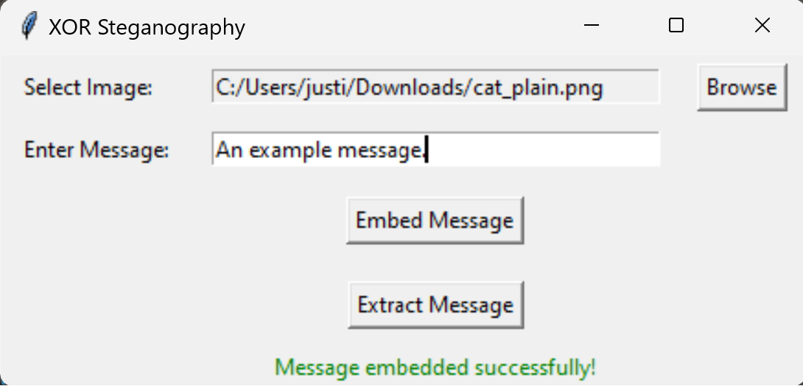

# README for XOR_LSB_Stego

## Overview
XOR_LSB_Stego is a Python-based implementation of a novel image steganography technique described in the accompanying paper. This technique enhances the security of the Least Significant Bit (LSB) replacement method by introducing an XOR operation with the 7th bit of RGB components before embedding the data in the 8th bit. This README provides instructions on installation, usage, and understanding the underlying method.

## Installation

### Requirements
- Python 3.x
- Dependencies listed in `requirements.txt`

### Steps
1. Clone the repository:
   ```
   git clone https://github.com/JustinPack/XOR_LSB_Stego.git
   ```
2. Navigate to the cloned directory:
   ```
   cd XOR_LSB_Stego
   ```
3. Install the required packages:
   ```
   pip install -r requirements.txt
   ```

## Usage

### Basic Command
To use the XOR_LSB_Stego tool, just run the script:
```
python xor_lsb_stego.py
```
*Replace `[options]` with the relevant options for your task (embedding or extracting data).*

### Example Usage
- **Embedding Data**: 
  
- **Extracting Data**: 
  

## Methodology

### Abstract from the Paper
The paper proposes a highly secure data hiding technique in the spatial domain of image steganography. It involves an XOR operation with the 7th bit of each RGB component, followed by embedding the output in the 8th bit. This approach ensures no trace of the original message in the cover object without using an external key. The method shows high PSNR (55.90 dB) and low MSE, indicating enhanced imperceptibility and security compared to other techniques.

### Key Concepts
- **Least Significant Bit (LSB) Replacement**: A popular method in image steganography for its simplicity and effectiveness.
- **XOR Operation**: Enhances security by manipulating the 7th bit of RGB components before data embedding.
- **PSNR and MSE Analysis**: Used to evaluate the quality and security of the steganographic technique.

## Contribution
Feel free to contribute to this project by submitting pull requests or opening issues for bugs and feature requests.

## License
This project is licensed under the MIT License - see the [LICENSE](LICENSE) file for details.

## Acknowledgements
Huge shout out to @tapatiohaxx for the initial UI and the inspiration to complete this script, as well as a special thanks to the authors of the paper for their groundbreaking work in the field of image steganography.
